# Contributing

## Raise an Issue

Raising [issues](https://github.com/cyndra-hq/cyndra/issues) is encouraged. We have some templates to help you get started.

## Running Locally
You can use Docker and docker-compose to test cyndra locally during development. See the [Docker install](https://docs.docker.com/get-docker/)
and [docker-compose install](https://docs.docker.com/compose/install/) instructions if you do not have them installed already.

You should now be ready to setup a local environment to test code changes to core `cyndra` packages as follows:

Build the required images with:

```bash
$ make images
```

The images get built with [cargo-chef](https://github.com/LukeMathWalker/cargo-chef) and therefore support incremental builds (most of the time). So they will be much faster to re-build after an incremental change in your code - should you wish to deploy it locally straight away.

Create docker persistent volumes with:

```bash
$ docker volume create cyndra-backend-vol
$ docker volume create cyndra-cargo-registry-vol
```

Finally, you can start a local deployment of cyndra and the required containers with:

```bash
$ make up
```

Note: Other useful commands can be found within the [Makefile](https://github.com/cyndra-hq/cyndra/blob/main/Makefile).

The API is now accessible on `localhost:8000` (for app proxies) and `localhost:8001` (for the control plane). When running `cargo run --bin cargo-cyndra` (in a debug build), the CLI will point itself to `localhost` for its API calls. The deployment parameters can be tweaked by changing values in the [.env](./.env) file.

In order to test local changes to the `cyndra-service` crate, you may want to add the below to a `.cargo/config.toml` file. (See [Overriding Dependencies](https://doc.rust-lang.org/cargo/reference/overriding-dependencies.html) for more)

``` toml
[patch.crates-io]
cyndra-service = { path = "[base]/cyndra/service" }
```

Login to cyndra service in a new terminal window from the main cyndra directory:

```bash
cargo run --bin cargo-cyndra -- login --api-key "test-key"
```

cd into one of the examples:

```bash
cd examples/rocket/hello-world/
```

Deploy the example:

```bash
# the --manifest-path is used to locate the root of the cyndra workspace
cargo run --manifest-path ../../../Cargo.toml --bin cargo-cyndra -- deploy
```

Test if the deploy is working:

```bash
# (the Host header should match the Host from the deploy output)
curl --header "Host: {app}.localhost.local" localhost:8000/hello
```
### Using Podman instead of Docker
If you are using Podman over Docker, then expose a rootless socket of Podman using the following command:

```bash
podman system service --time=0 unix:///tmp/podman.sock
```

Now make docker-compose use this socket by setting the following environment variable:

```bash
export DOCKER_HOST=unix:///tmp/podman.sock
```

cyndra can now be run locally using the steps shown earlier.

## Running Tests

cyndra has reasonable test coverage - and we are working on improving this
every day. We encourage PRs to come with tests. If you're not sure about
what a test should look like, feel free to [get in touch](https://discord.gg/H33rRDTm3p).

To run the test suite - just run `make test` at the root of the repository.

## Committing

We use the [Angular Commit Guidelines](https://github.com/angular/angular/blob/master/CONTRIBUTING.md#commit). We expect all commits to conform to these guidelines.

Furthermore, commits should be squashed before being merged to master.

Also, make sure your commits don't trigger any warnings from Clippy by running: `cargo clippy --tests --all-targets`. If you have a good reason to contradict Clippy, insert an #allow[] macro, so that it won't complain.

## Project Layout
The folders in this repository relate to each other as follow:

```mermaid
graph BT
    classDef default fill:#1f1f1f,stroke-width:0;
    classDef binary fill:#f25100,font-weight:bold,stroke-width:0;
    classDef external fill:#343434,font-style:italic,stroke:#f25100;

    deployer:::binary
    cargo-cyndra:::binary
    common
    codegen
    e2e
    proto
    provisioner:::binary
    service
    user([user service]):::external
    deployer --> proto
    deployer -.->|calls| provisioner
    service ---> common
    deployer --> common
    cargo-cyndra --->|"features = ['loader']"| service
    deployer -->|"features = ['loader', 'secrets']"| service
    cargo-cyndra --> common
    service --> codegen
    proto ---> common
    provisioner --> proto
    e2e -.->|starts up| deployer
    e2e -.->|calls| cargo-cyndra
    user -->|"features = ['codegen']"| service
```



First, `provisioner`, `deployer`, and `cargo-cyndra` are binary crates with `provisioner` and `deployer` being backend services. The `cargo-cyndra` binary is the `cargo cyndra` command used by users.

The rest are the following libraries:
- `common` contains shared models and functions used by the other libraries and binaries.
- `codegen` contains our proc-macro code which gets exposed to user services from `service` by the `codegen` feature flag. The redirect through `service` is to make it available under the prettier name of `cyndra_service::main`.
- `service` is where our special `Service` trait is defined. Anything implementing this `Service` can be loaded by the `deployer` and the local runner in `cargo-cyndra`.
   The `codegen` automatically implements the `Service` trait for any user service.
- `proto` contains the gRPC server and client definitions to allow `deployer` to communicate with `provisioner`.
- `e2e` just contains tests which starts up the `deployer` in a container and then deploys services to it using `cargo-cyndra`.

Lastly, the `user service` is not a folder in this repository, but is the user service that will be deployed by `deployer`.
